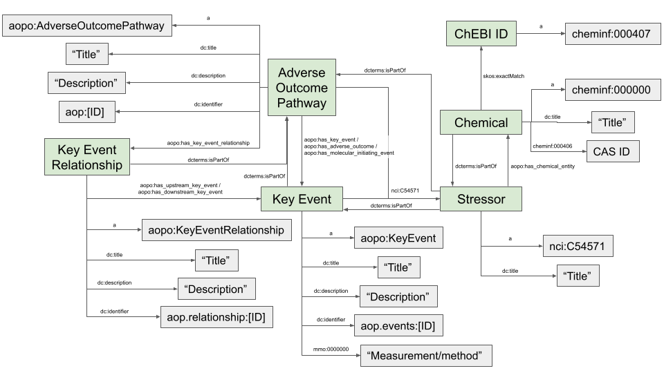

# AOP-Wiki

| **SPARQL endpoint** | [https://aopwiki.rdf.bigcat-bioinformatics.org/sparql/](https://aopwiki.rdf.bigcat-bioinformatics.org/sparql/) |

The <a name="tp1">AOP-Wiki</a> SPARQL endpoint is loaded with RDF of the
<a name="tp2">Adverse Outcome Pathway</a> (AOP)-Wiki database
([https://aopwiki.org/](https://aopwiki.org/))  [<a href="#citeref1">1</a>]. The AOP-Wiki serves as the primary repository of qualitative information
for AOPs and is a central component in the AOP development effort coordinated by the Organisation
for Economic Co-operation and Development (OECD). These AOPs describe mechanistic information about
toxicodynamic processes and can be used to develop effective risk assessment strategies. An AOP
is initiated by a stressor (e.g. a chemical) that causes a <a name="tp3">Molecular Initiating Event</a>, which is
followed by <a name="tp4">Key Eevent</a>s (measurable, essential steps) along a pathway towards an Adverse Outcome
for an organism or population. KEs are connected through Key Event Relationships (KERs), which
capture the evidence supporting the AOP in a structured way. 

The AOP-Wiki SPARQL endpoint is accessible on [https://aopwiki.rdf.bigcat-bioinformatics.org](https://aopwiki.rdf.bigcat-bioinformatics.org/)

## Entities

The main classes are:

* Adverse Outcome Pathway: a pathway that describes how an initiating event leads to an adverse outcome
* Gene
* Protein 

## Data model

The figure describing the RDF schema:



## Example queries

The simplest SPARQL queries to explore RDF is to retrieve full lists of subjects of a particular type, which is
frequently defined with the predicate `rdfs:type` or `a` which can be used interchangably. See the below
example of listing all Key Events.

**SPARQL** [sparql/keyevent.rq](sparql/keyevent.code.html) ([run](https://aopwiki.rdf.bigcat-bioinformatics.org/sparql/?query=SELECT%20%3FKE%20%0AWHERE%20%7B%0A%20%20%3FKE%20a%20aopo%3AKeyEvent%20.%0A%7D%0A), [edit](https://aopwiki.rdf.bigcat-bioinformatics.org/?q=SELECT%20%3FKE%20%0AWHERE%20%7B%0A%20%20%3FKE%20a%20aopo%3AKeyEvent%20.%0A%7D%0A))

```sparql
SELECT ?KE 
WHERE {
  ?KE a aopo:KeyEvent .
}
```

Since the Key Event links can bring you to the AOP-Wiki for further exploration of the corresponding webpage,
we can also directly request all their contents through the SPARQL query. For example, to extract the
Key Event title, we add `?KE dc:title ?KEtitle` to the SPARQL query. The returned table upon running the
query will get wider, so you might need to scroll to the right. 

**SPARQL** [sparql/keyeventWithTitle.rq](sparql/keyeventWithTitle.code.html) ([run](https://aopwiki.rdf.bigcat-bioinformatics.org/sparql/?query=SELECT%20%3FKE%20%3FKEtitle%0AWHERE%20%7B%0A%20%20%3FKE%20a%20aopo%3AKeyEvent%20.%0A%20%20%3FKE%20dc%3Atitle%20%3FKEtitle%20.%0A%7D%0A), [edit](https://aopwiki.rdf.bigcat-bioinformatics.org/?q=SELECT%20%3FKE%20%3FKEtitle%0AWHERE%20%7B%0A%20%20%3FKE%20a%20aopo%3AKeyEvent%20.%0A%20%20%3FKE%20dc%3Atitle%20%3FKEtitle%20.%0A%7D%0A))

```sparql
SELECT ?KE ?KEtitle
WHERE {
  ?KE a aopo:KeyEvent .
  ?KE dc:title ?KEtitle .
}
```

### Counting key events

This exercise is about creating simple SPARQL queries that count particular types of subjects in the
RDF. See the example SPARQL query below that counts the number of Key Events in the RDF.

**SPARQL** [sparql/keyeventCount.rq](sparql/keyeventCount.code.html) ([run](https://aopwiki.rdf.bigcat-bioinformatics.org/sparql/?query=SELECT%20%28count%20%28%3FKE%29%20as%20%3FnKE%29%20%0AWHERE%20%7B%0A%20%20%3FKE%20a%20aopo%3AKeyEvent%20.%0A%7D%0A), [edit](https://aopwiki.rdf.bigcat-bioinformatics.org/?q=SELECT%20%28count%20%28%3FKE%29%20as%20%3FnKE%29%20%0AWHERE%20%7B%0A%20%20%3FKE%20a%20aopo%3AKeyEvent%20.%0A%7D%0A))

```sparql
SELECT (count (?KE) as ?nKE) 
WHERE {
  ?KE a aopo:KeyEvent .
}
```

Which returns:

<!-- https://aopwiki.rdf.bigcat-bioinformatics.org/sparql -->
<table>
  <tr>
    <td><b>nKE</b></td>
  </tr>
  <tr>
    <td>1371</td>
  </tr>
</table>

## References

1. <a name="citeref1"></a>Martens M, Evelo CT, Willighagen EL. Providing Adverse Outcome Pathways from the AOP-Wiki in a Semantic Web Format to Increase Usability and Accessibility of the Content. Applied In Vitro Toxicology. 2022 Feb 25;  doi:[10.1089/AIVT.2021.0010](https://doi.org/10.1089/AIVT.2021.0010) ([Scholia](https://scholia.toolforge.org/doi/10.1089/AIVT.2021.0010))

