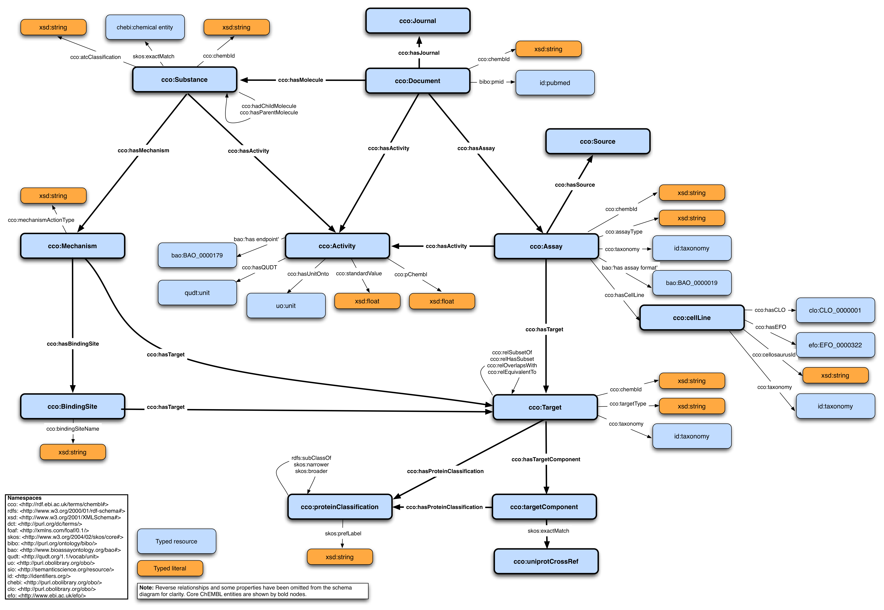

# ChEMBL

<a name="tp1">ChEMBL</a> is a manually curated database of bioactive
molecules with drug-like properties [<a href="#citeref1">1</a>,<a href="#citeref2">2</a>].
It brings together chemical, bioactivity and genomic data to aid the translation of
genomic information into effective new drugs. Built upon the ChEMBL database, an RDF
representation of the ChEMBL database is produced by the European Molecular Biology
Laboratory - European Bioinformatics Institute (EMBL-EBI) and provided for
[download](https://www.ebi.ac.uk/rdf/services/sparql). The ChEMBL RDF model uses a
basic internal ontology, called the <a name="tp2">ChEMBL Core Ontology</a> (CCO), to identify all of
the primary entities (e.g., Documents, Assays, Substances, Targets) in the
ChEMBL database.

The Department of Bioinformatics (BiGCaT) at Maastricht University
took the initiative to host the RDF and expose it to the scientific community through
a SPARQL endpoint where queries can be executed against the RDF to find answers to
biological questions. The tool is available through https://chemblmirror.rdf.bigcat-bioinformatics.org/.

## Entities

The main classes are:

* Protein: <a name="tp3">protein</a> targets
* Metabolite: ligand, e.g. <a name="tp4">drug</a> / drug-like compound
* Assay: measures some property of, for example, the protein-ligand binding
* Document: source of the data or knowledge

## Data model



## Exercises

The simplest SPARQL queries to explore RDF is to retrieve full lists of subjects of a
particular type, which is frequently defined with the predicate `rdfs:type` or "a" which
can be used interchangably. The type itself can be part of a hierarchy and then we can
specify the type of a particular subclass using the predicate `rdfs:subClassOf`. See
the below example of listing all molecules in the ChEMBL RDF where the molecule type is
a subclass of the `cco:Substance` class.

**SPARQL** [sparql/substances.rq](sparql/substances.code.html) ([run](https://chemblmirror.rdf.bigcat-bioinformatics.org/sparql/?query=PREFIX%20rdf%3A%20%3Chttp%3A%2F%2Fwww.w3.org%2F1999%2F02%2F22-rdf-syntax-ns%23%3E%0APREFIX%20rdfs%3A%20%3Chttp%3A%2F%2Fwww.w3.org%2F2000%2F01%2Frdf-schema%23%3E%0APREFIX%20owl%3A%20%3Chttp%3A%2F%2Fwww.w3.org%2F2002%2F07%2Fowl%23%3E%0APREFIX%20xsd%3A%20%3Chttp%3A%2F%2Fwww.w3.org%2F2001%2FXMLSchema%23%3E%0APREFIX%20dc%3A%20%3Chttp%3A%2F%2Fpurl.org%2Fdc%2Felements%2F1.1%2F%3E%0APREFIX%20dcterms%3A%20%3Chttp%3A%2F%2Fpurl.org%2Fdc%2Fterms%2F%3E%0APREFIX%20dbpedia2%3A%20%3Chttp%3A%2F%2Fdbpedia.org%2Fproperty%2F%3E%0APREFIX%20dbpedia%3A%20%3Chttp%3A%2F%2Fdbpedia.org%2F%3E%0APREFIX%20foaf%3A%20%3Chttp%3A%2F%2Fxmlns.com%2Ffoaf%2F0.1%2F%3E%0APREFIX%20skos%3A%20%3Chttp%3A%2F%2Fwww.w3.org%2F2004%2F02%2Fskos%2Fcore%23%3E%0A%0APREFIX%20cco%3A%20%3Chttp%3A%2F%2Frdf.ebi.ac.uk%2Fterms%2Fchembl%23%3E%0ASELECT%20%3Fmolecule%0AWHERE%20%7B%0A%20%20%3Fmolecule%20a%20%3Ftype%20.%0A%20%20%3Ftype%20rdfs%3AsubClassOf*%20cco%3ASubstance%20.%0A%7D%20limit%2020%0A), [edit](https://chemblmirror.rdf.bigcat-bioinformatics.org/?q=PREFIX%20rdf%3A%20%3Chttp%3A%2F%2Fwww.w3.org%2F1999%2F02%2F22-rdf-syntax-ns%23%3E%0APREFIX%20rdfs%3A%20%3Chttp%3A%2F%2Fwww.w3.org%2F2000%2F01%2Frdf-schema%23%3E%0APREFIX%20owl%3A%20%3Chttp%3A%2F%2Fwww.w3.org%2F2002%2F07%2Fowl%23%3E%0APREFIX%20xsd%3A%20%3Chttp%3A%2F%2Fwww.w3.org%2F2001%2FXMLSchema%23%3E%0APREFIX%20dc%3A%20%3Chttp%3A%2F%2Fpurl.org%2Fdc%2Felements%2F1.1%2F%3E%0APREFIX%20dcterms%3A%20%3Chttp%3A%2F%2Fpurl.org%2Fdc%2Fterms%2F%3E%0APREFIX%20dbpedia2%3A%20%3Chttp%3A%2F%2Fdbpedia.org%2Fproperty%2F%3E%0APREFIX%20dbpedia%3A%20%3Chttp%3A%2F%2Fdbpedia.org%2F%3E%0APREFIX%20foaf%3A%20%3Chttp%3A%2F%2Fxmlns.com%2Ffoaf%2F0.1%2F%3E%0APREFIX%20skos%3A%20%3Chttp%3A%2F%2Fwww.w3.org%2F2004%2F02%2Fskos%2Fcore%23%3E%0A%0APREFIX%20cco%3A%20%3Chttp%3A%2F%2Frdf.ebi.ac.uk%2Fterms%2Fchembl%23%3E%0ASELECT%20%3Fmolecule%0AWHERE%20%7B%0A%20%20%3Fmolecule%20a%20%3Ftype%20.%0A%20%20%3Ftype%20rdfs%3AsubClassOf*%20cco%3ASubstance%20.%0A%7D%20limit%2020%0A))

```sparql
PREFIX rdf: <http://www.w3.org/1999/02/22-rdf-syntax-ns#>
PREFIX rdfs: <http://www.w3.org/2000/01/rdf-schema#>
PREFIX owl: <http://www.w3.org/2002/07/owl#>
PREFIX xsd: <http://www.w3.org/2001/XMLSchema#>
PREFIX dc: <http://purl.org/dc/elements/1.1/>
PREFIX dcterms: <http://purl.org/dc/terms/>
PREFIX dbpedia2: <http://dbpedia.org/property/>
PREFIX dbpedia: <http://dbpedia.org/>
PREFIX foaf: <http://xmlns.com/foaf/0.1/>
PREFIX skos: <http://www.w3.org/2004/02/skos/core#>
PREFIX cco: <http://rdf.ebi.ac.uk/terms/chembl#>
SELECT ?molecule
WHERE {
  ?molecule a ?type .
  ?type rdfs:subClassOf* cco:Substance .
} limit 20
```


### ChEMBL sources

**SPARQL** [sparql/chemblSources.rq](sparql/chemblSources.code.html) ([run](https://chemblmirror.rdf.bigcat-bioinformatics.org/sparql/?query=PREFIX%20rdf%3A%20%3Chttp%3A%2F%2Fwww.w3.org%2F1999%2F02%2F22-rdf-syntax-ns%23%3E%0APREFIX%20rdfs%3A%20%3Chttp%3A%2F%2Fwww.w3.org%2F2000%2F01%2Frdf-schema%23%3E%0APREFIX%20owl%3A%20%3Chttp%3A%2F%2Fwww.w3.org%2F2002%2F07%2Fowl%23%3E%0APREFIX%20xsd%3A%20%3Chttp%3A%2F%2Fwww.w3.org%2F2001%2FXMLSchema%23%3E%0APREFIX%20dc%3A%20%3Chttp%3A%2F%2Fpurl.org%2Fdc%2Felements%2F1.1%2F%3E%0APREFIX%20dcterms%3A%20%3Chttp%3A%2F%2Fpurl.org%2Fdc%2Fterms%2F%3E%0APREFIX%20dbpedia2%3A%20%3Chttp%3A%2F%2Fdbpedia.org%2Fproperty%2F%3E%0APREFIX%20dbpedia%3A%20%3Chttp%3A%2F%2Fdbpedia.org%2F%3E%0APREFIX%20foaf%3A%20%3Chttp%3A%2F%2Fxmlns.com%2Ffoaf%2F0.1%2F%3E%0APREFIX%20skos%3A%20%3Chttp%3A%2F%2Fwww.w3.org%2F2004%2F02%2Fskos%2Fcore%23%3E%0A%0APREFIX%20cco%3A%20%3Chttp%3A%2F%2Frdf.ebi.ac.uk%2Fterms%2Fchembl%23%3E%0ASELECT%20%3FSource%0A%20%20%20WHERE%20%7B%0A%20%20%20%3FSource%20%3Fp%20cco%3ASource%20.%0A%7D%20LIMIT%20100%0A), [edit](https://chemblmirror.rdf.bigcat-bioinformatics.org/?q=PREFIX%20rdf%3A%20%3Chttp%3A%2F%2Fwww.w3.org%2F1999%2F02%2F22-rdf-syntax-ns%23%3E%0APREFIX%20rdfs%3A%20%3Chttp%3A%2F%2Fwww.w3.org%2F2000%2F01%2Frdf-schema%23%3E%0APREFIX%20owl%3A%20%3Chttp%3A%2F%2Fwww.w3.org%2F2002%2F07%2Fowl%23%3E%0APREFIX%20xsd%3A%20%3Chttp%3A%2F%2Fwww.w3.org%2F2001%2FXMLSchema%23%3E%0APREFIX%20dc%3A%20%3Chttp%3A%2F%2Fpurl.org%2Fdc%2Felements%2F1.1%2F%3E%0APREFIX%20dcterms%3A%20%3Chttp%3A%2F%2Fpurl.org%2Fdc%2Fterms%2F%3E%0APREFIX%20dbpedia2%3A%20%3Chttp%3A%2F%2Fdbpedia.org%2Fproperty%2F%3E%0APREFIX%20dbpedia%3A%20%3Chttp%3A%2F%2Fdbpedia.org%2F%3E%0APREFIX%20foaf%3A%20%3Chttp%3A%2F%2Fxmlns.com%2Ffoaf%2F0.1%2F%3E%0APREFIX%20skos%3A%20%3Chttp%3A%2F%2Fwww.w3.org%2F2004%2F02%2Fskos%2Fcore%23%3E%0A%0APREFIX%20cco%3A%20%3Chttp%3A%2F%2Frdf.ebi.ac.uk%2Fterms%2Fchembl%23%3E%0ASELECT%20%3FSource%0A%20%20%20WHERE%20%7B%0A%20%20%20%3FSource%20%3Fp%20cco%3ASource%20.%0A%7D%20LIMIT%20100%0A))

```sparql
PREFIX rdf: <http://www.w3.org/1999/02/22-rdf-syntax-ns#>
PREFIX rdfs: <http://www.w3.org/2000/01/rdf-schema#>
PREFIX owl: <http://www.w3.org/2002/07/owl#>
PREFIX xsd: <http://www.w3.org/2001/XMLSchema#>
PREFIX dc: <http://purl.org/dc/elements/1.1/>
PREFIX dcterms: <http://purl.org/dc/terms/>
PREFIX dbpedia2: <http://dbpedia.org/property/>
PREFIX dbpedia: <http://dbpedia.org/>
PREFIX foaf: <http://xmlns.com/foaf/0.1/>
PREFIX skos: <http://www.w3.org/2004/02/skos/core#>
PREFIX cco: <http://rdf.ebi.ac.uk/terms/chembl#>
SELECT ?Source
   WHERE {
   ?Source ?p cco:Source .
} LIMIT 100
```

### Counting assays

This query gets the count of the assays used to measure the activity of the molecule with ID (CHEMBL294873):

**SPARQL** [sparql/countingChEMBLAssays.rq](sparql/countingChEMBLAssays.code.html) ([run](https://chemblmirror.rdf.bigcat-bioinformatics.org/sparql/?query=PREFIX%20rdf%3A%20%3Chttp%3A%2F%2Fwww.w3.org%2F1999%2F02%2F22-rdf-syntax-ns%23%3E%0APREFIX%20rdfs%3A%20%3Chttp%3A%2F%2Fwww.w3.org%2F2000%2F01%2Frdf-schema%23%3E%0APREFIX%20owl%3A%20%3Chttp%3A%2F%2Fwww.w3.org%2F2002%2F07%2Fowl%23%3E%0APREFIX%20xsd%3A%20%3Chttp%3A%2F%2Fwww.w3.org%2F2001%2FXMLSchema%23%3E%0APREFIX%20dc%3A%20%3Chttp%3A%2F%2Fpurl.org%2Fdc%2Felements%2F1.1%2F%3E%0APREFIX%20dcterms%3A%20%3Chttp%3A%2F%2Fpurl.org%2Fdc%2Fterms%2F%3E%0APREFIX%20dbpedia2%3A%20%3Chttp%3A%2F%2Fdbpedia.org%2Fproperty%2F%3E%0APREFIX%20dbpedia%3A%20%3Chttp%3A%2F%2Fdbpedia.org%2F%3E%0APREFIX%20foaf%3A%20%3Chttp%3A%2F%2Fxmlns.com%2Ffoaf%2F0.1%2F%3E%0APREFIX%20skos%3A%20%3Chttp%3A%2F%2Fwww.w3.org%2F2004%2F02%2Fskos%2Fcore%23%3E%0APREFIX%20cco%3A%20%3Chttp%3A%2F%2Frdf.ebi.ac.uk%2Fterms%2Fchembl%23%3E%0APREFIX%20chembl_molecule%3A%20%3Chttp%3A%2F%2Frdf.ebi.ac.uk%2Fresource%2Fchembl%2Fmolecule%2F%3E%0A%0ASELECT%20%28count%28%3Fassay%29%20as%20%3FassayCount%29%0AWHERE%20%7B%0A%20%20%3Factivity%20a%20cco%3AActivity%20%3B%0A%20%20%20%20%20%20%20%20%20%20%20%20%20%20%20%20cco%3AhasMolecule%20chembl_molecule%3ACHEMBL294873%20%3B%0A%20%20%20%20%20%20%20%20%20%20%20%20%20%20%20%20cco%3AhasAssay%20%3Fassay%20.%0A%0A%20%20%3Fassay%20cco%3AhasSource%20%3Fsource%20.%0A%7D%0A%0A), [edit](https://chemblmirror.rdf.bigcat-bioinformatics.org/?q=PREFIX%20rdf%3A%20%3Chttp%3A%2F%2Fwww.w3.org%2F1999%2F02%2F22-rdf-syntax-ns%23%3E%0APREFIX%20rdfs%3A%20%3Chttp%3A%2F%2Fwww.w3.org%2F2000%2F01%2Frdf-schema%23%3E%0APREFIX%20owl%3A%20%3Chttp%3A%2F%2Fwww.w3.org%2F2002%2F07%2Fowl%23%3E%0APREFIX%20xsd%3A%20%3Chttp%3A%2F%2Fwww.w3.org%2F2001%2FXMLSchema%23%3E%0APREFIX%20dc%3A%20%3Chttp%3A%2F%2Fpurl.org%2Fdc%2Felements%2F1.1%2F%3E%0APREFIX%20dcterms%3A%20%3Chttp%3A%2F%2Fpurl.org%2Fdc%2Fterms%2F%3E%0APREFIX%20dbpedia2%3A%20%3Chttp%3A%2F%2Fdbpedia.org%2Fproperty%2F%3E%0APREFIX%20dbpedia%3A%20%3Chttp%3A%2F%2Fdbpedia.org%2F%3E%0APREFIX%20foaf%3A%20%3Chttp%3A%2F%2Fxmlns.com%2Ffoaf%2F0.1%2F%3E%0APREFIX%20skos%3A%20%3Chttp%3A%2F%2Fwww.w3.org%2F2004%2F02%2Fskos%2Fcore%23%3E%0APREFIX%20cco%3A%20%3Chttp%3A%2F%2Frdf.ebi.ac.uk%2Fterms%2Fchembl%23%3E%0APREFIX%20chembl_molecule%3A%20%3Chttp%3A%2F%2Frdf.ebi.ac.uk%2Fresource%2Fchembl%2Fmolecule%2F%3E%0A%0ASELECT%20%28count%28%3Fassay%29%20as%20%3FassayCount%29%0AWHERE%20%7B%0A%20%20%3Factivity%20a%20cco%3AActivity%20%3B%0A%20%20%20%20%20%20%20%20%20%20%20%20%20%20%20%20cco%3AhasMolecule%20chembl_molecule%3ACHEMBL294873%20%3B%0A%20%20%20%20%20%20%20%20%20%20%20%20%20%20%20%20cco%3AhasAssay%20%3Fassay%20.%0A%0A%20%20%3Fassay%20cco%3AhasSource%20%3Fsource%20.%0A%7D%0A%0A))

```sparql
PREFIX rdf: <http://www.w3.org/1999/02/22-rdf-syntax-ns#>
PREFIX rdfs: <http://www.w3.org/2000/01/rdf-schema#>
PREFIX owl: <http://www.w3.org/2002/07/owl#>
PREFIX xsd: <http://www.w3.org/2001/XMLSchema#>
PREFIX dc: <http://purl.org/dc/elements/1.1/>
PREFIX dcterms: <http://purl.org/dc/terms/>
PREFIX dbpedia2: <http://dbpedia.org/property/>
PREFIX dbpedia: <http://dbpedia.org/>
PREFIX foaf: <http://xmlns.com/foaf/0.1/>
PREFIX skos: <http://www.w3.org/2004/02/skos/core#>
PREFIX cco: <http://rdf.ebi.ac.uk/terms/chembl#>
PREFIX chembl_molecule: <http://rdf.ebi.ac.uk/resource/chembl/molecule/>
SELECT (count(?assay) as ?assayCount)
WHERE {
  ?activity a cco:Activity ;
                cco:hasMolecule chembl_molecule:CHEMBL294873 ;
                cco:hasAssay ?assay .
  ?assay cco:hasSource ?source .
}
```

### Binding affinities

To get all assay, <a name="tp5">binding affinity</a> type (Kd, Ki, IC50) and affinity value for all compounds
targeting Thrombin protein (`CHEMBL204`):

**SPARQL** [sparql/bindingAffinities.rq](sparql/bindingAffinities.code.html) ([run](https://chemblmirror.rdf.bigcat-bioinformatics.org/sparql/?query=PREFIX%20chembl%3A%20%3Chttp%3A%2F%2Frdf.ebi.ac.uk%2Fterms%2Fchembl%23%3E%0APREFIX%20cco%3A%20%3Chttp%3A%2F%2Frdf.ebi.ac.uk%2Fterms%2Fchembl%23%3E%0APREFIX%20chembl_molecule%3A%20%3Chttp%3A%2F%2Frdf.ebi.ac.uk%2Fresource%2Fchembl%2Fmolecule%2F%3E%0APREFIX%20chembl_target%3A%20%3Chttp%3A%2F%2Frdf.ebi.ac.uk%2Fresource%2Fchembl%2Ftarget%2F%3E%0A%0ASELECT%20distinct%20%3FassayLabel%20%3FassayType%20%3FmolLabel%20%3FbindingAffinityType%20%3Fvalue%20WHERE%20%7B%0A%0A%20%20%3Fassay%20%20chembl%3AhasTarget%20chembl_target%3ACHEMBL204.%0A%20%20%0A%20%20%3Factivity%20chembl%3AhasAssay%20%20%3Fassay.%0A%20%20%3Fassay%20cco%3AassayType%20%3FassayType.%0A%20%20%3Factivity%20chembl%3AhasMolecule%20%3Fmolecule%20.%0A%0A%20%20chembl_target%3ACHEMBL204%20rdfs%3Alabel%20%3FtargetLabel.%0A%20%20%3Fmolecule%20rdfs%3Alabel%20%3FmolLabel.%0A%20%20%3Fassay%20%20rdfs%3Alabel%20%3FassayLabel.%0A%0A%20%20VALUES%20%3FbindingAffinityType%20%7B%22Kd%22%20%22Ki%22%20%22IC50%22%7D%0A%20%20%3Factivity%20chembl%3Atype%20%3FbindingAffinityType.%0A%20%20%3Factivity%20chembl%3AstandardValue%20%3Fvalue.%0A%0A%7D%20limit%20100%0A), [edit](https://chemblmirror.rdf.bigcat-bioinformatics.org/?q=PREFIX%20chembl%3A%20%3Chttp%3A%2F%2Frdf.ebi.ac.uk%2Fterms%2Fchembl%23%3E%0APREFIX%20cco%3A%20%3Chttp%3A%2F%2Frdf.ebi.ac.uk%2Fterms%2Fchembl%23%3E%0APREFIX%20chembl_molecule%3A%20%3Chttp%3A%2F%2Frdf.ebi.ac.uk%2Fresource%2Fchembl%2Fmolecule%2F%3E%0APREFIX%20chembl_target%3A%20%3Chttp%3A%2F%2Frdf.ebi.ac.uk%2Fresource%2Fchembl%2Ftarget%2F%3E%0A%0ASELECT%20distinct%20%3FassayLabel%20%3FassayType%20%3FmolLabel%20%3FbindingAffinityType%20%3Fvalue%20WHERE%20%7B%0A%0A%20%20%3Fassay%20%20chembl%3AhasTarget%20chembl_target%3ACHEMBL204.%0A%20%20%0A%20%20%3Factivity%20chembl%3AhasAssay%20%20%3Fassay.%0A%20%20%3Fassay%20cco%3AassayType%20%3FassayType.%0A%20%20%3Factivity%20chembl%3AhasMolecule%20%3Fmolecule%20.%0A%0A%20%20chembl_target%3ACHEMBL204%20rdfs%3Alabel%20%3FtargetLabel.%0A%20%20%3Fmolecule%20rdfs%3Alabel%20%3FmolLabel.%0A%20%20%3Fassay%20%20rdfs%3Alabel%20%3FassayLabel.%0A%0A%20%20VALUES%20%3FbindingAffinityType%20%7B%22Kd%22%20%22Ki%22%20%22IC50%22%7D%0A%20%20%3Factivity%20chembl%3Atype%20%3FbindingAffinityType.%0A%20%20%3Factivity%20chembl%3AstandardValue%20%3Fvalue.%0A%0A%7D%20limit%20100%0A))

```sparql
PREFIX chembl: <http://rdf.ebi.ac.uk/terms/chembl#>
PREFIX cco: <http://rdf.ebi.ac.uk/terms/chembl#>
PREFIX chembl_molecule: <http://rdf.ebi.ac.uk/resource/chembl/molecule/>
PREFIX chembl_target: <http://rdf.ebi.ac.uk/resource/chembl/target/>
SELECT distinct ?assayLabel ?assayType ?molLabel ?bindingAffinityType ?value WHERE {
  ?assay  chembl:hasTarget chembl_target:CHEMBL204.
  ?activity chembl:hasAssay  ?assay.
  ?assay cco:assayType ?assayType.
  ?activity chembl:hasMolecule ?molecule .
  chembl_target:CHEMBL204 rdfs:label ?targetLabel.
  ?molecule rdfs:label ?molLabel.
  ?assay  rdfs:label ?assayLabel.
  VALUES ?bindingAffinityType {"Kd" "Ki" "IC50"}
  ?activity chembl:type ?bindingAffinityType.
  ?activity chembl:standardValue ?value.
} limit 100
```

The above query get assays and molecules information along with binding affinity type and value limited ti the top 100 entry.

### Assays and UniProt IDs

To list all assays, target names and UniProt IDs for the drug Paracetamol (`CHEBI:46195`):

**SPARQL** [sparql/paracetamol.rq](sparql/paracetamol.code.html) ([run](https://chemblmirror.rdf.bigcat-bioinformatics.org/sparql/?query=PREFIX%20rdf%3A%20%3Chttp%3A%2F%2Fwww.w3.org%2F1999%2F02%2F22-rdf-syntax-ns%23%3E%0APREFIX%20rdfs%3A%20%3Chttp%3A%2F%2Fwww.w3.org%2F2000%2F01%2Frdf-schema%23%3E%0APREFIX%20owl%3A%20%3Chttp%3A%2F%2Fwww.w3.org%2F2002%2F07%2Fowl%23%3E%0APREFIX%20xsd%3A%20%3Chttp%3A%2F%2Fwww.w3.org%2F2001%2FXMLSchema%23%3E%0APREFIX%20dc%3A%20%3Chttp%3A%2F%2Fpurl.org%2Fdc%2Felements%2F1.1%2F%3E%0APREFIX%20dcterms%3A%20%3Chttp%3A%2F%2Fpurl.org%2Fdc%2Fterms%2F%3E%0APREFIX%20dbpedia2%3A%20%3Chttp%3A%2F%2Fdbpedia.org%2Fproperty%2F%3E%0APREFIX%20dbpedia%3A%20%3Chttp%3A%2F%2Fdbpedia.org%2F%3E%0APREFIX%20foaf%3A%20%3Chttp%3A%2F%2Fxmlns.com%2Ffoaf%2F0.1%2F%3E%0APREFIX%20skos%3A%20%3Chttp%3A%2F%2Fwww.w3.org%2F2004%2F02%2Fskos%2Fcore%23%3E%0A%0APREFIX%20cco%3A%20%3Chttp%3A%2F%2Frdf.ebi.ac.uk%2Fterms%2Fchembl%23%3E%0APREFIX%20chembl_molecule%3A%20%3Chttp%3A%2F%2Frdf.ebi.ac.uk%2Fresource%2Fchembl%2Fmolecule%2F%3E%0ASELECT%20%3FactivityLabel%20%3FassayType%20%3FtargetLabel%20%3Funiprot%0AWHERE%20%7B%0A%0A%20%20%3Factivity%20a%20cco%3AActivity%20%3B%0A%20%20%20%20%20%20%20%20%20%20%20%20%20%20%20%20rdfs%3Alabel%20%3FactivityLabel%3B%0A%20%20%20%20%20%20%20%20%20%20%20%20%20%20%20%20cco%3AhasMolecule%20chembl_molecule%3ACHEMBL46195%20%3B%0A%20%20%20%20%20%20%20%20%20%20%20%20%20%20%20%20cco%3AhasAssay%20%3Fassay%20.%0A%0A%20%20%3Fassay%20cco%3AassayType%20%3FassayType.%0A%20%20%3Fassay%20cco%3AhasTarget%20%3Ftarget%20.%0A%20%20%0A%20%20%3Ftarget%20rdfs%3Alabel%20%3FtargetLabel.%0A%20%20%3Ftarget%20cco%3AhasTargetComponent%20%3Ftargetcmpt%20.%0A%20%20%3Ftargetcmpt%20cco%3AtargetCmptXref%20%3Funiprot%20.%0A%20%20%3Funiprot%20a%20cco%3AUniprotRef%0A%7D%0A), [edit](https://chemblmirror.rdf.bigcat-bioinformatics.org/?q=PREFIX%20rdf%3A%20%3Chttp%3A%2F%2Fwww.w3.org%2F1999%2F02%2F22-rdf-syntax-ns%23%3E%0APREFIX%20rdfs%3A%20%3Chttp%3A%2F%2Fwww.w3.org%2F2000%2F01%2Frdf-schema%23%3E%0APREFIX%20owl%3A%20%3Chttp%3A%2F%2Fwww.w3.org%2F2002%2F07%2Fowl%23%3E%0APREFIX%20xsd%3A%20%3Chttp%3A%2F%2Fwww.w3.org%2F2001%2FXMLSchema%23%3E%0APREFIX%20dc%3A%20%3Chttp%3A%2F%2Fpurl.org%2Fdc%2Felements%2F1.1%2F%3E%0APREFIX%20dcterms%3A%20%3Chttp%3A%2F%2Fpurl.org%2Fdc%2Fterms%2F%3E%0APREFIX%20dbpedia2%3A%20%3Chttp%3A%2F%2Fdbpedia.org%2Fproperty%2F%3E%0APREFIX%20dbpedia%3A%20%3Chttp%3A%2F%2Fdbpedia.org%2F%3E%0APREFIX%20foaf%3A%20%3Chttp%3A%2F%2Fxmlns.com%2Ffoaf%2F0.1%2F%3E%0APREFIX%20skos%3A%20%3Chttp%3A%2F%2Fwww.w3.org%2F2004%2F02%2Fskos%2Fcore%23%3E%0A%0APREFIX%20cco%3A%20%3Chttp%3A%2F%2Frdf.ebi.ac.uk%2Fterms%2Fchembl%23%3E%0APREFIX%20chembl_molecule%3A%20%3Chttp%3A%2F%2Frdf.ebi.ac.uk%2Fresource%2Fchembl%2Fmolecule%2F%3E%0ASELECT%20%3FactivityLabel%20%3FassayType%20%3FtargetLabel%20%3Funiprot%0AWHERE%20%7B%0A%0A%20%20%3Factivity%20a%20cco%3AActivity%20%3B%0A%20%20%20%20%20%20%20%20%20%20%20%20%20%20%20%20rdfs%3Alabel%20%3FactivityLabel%3B%0A%20%20%20%20%20%20%20%20%20%20%20%20%20%20%20%20cco%3AhasMolecule%20chembl_molecule%3ACHEMBL46195%20%3B%0A%20%20%20%20%20%20%20%20%20%20%20%20%20%20%20%20cco%3AhasAssay%20%3Fassay%20.%0A%0A%20%20%3Fassay%20cco%3AassayType%20%3FassayType.%0A%20%20%3Fassay%20cco%3AhasTarget%20%3Ftarget%20.%0A%20%20%0A%20%20%3Ftarget%20rdfs%3Alabel%20%3FtargetLabel.%0A%20%20%3Ftarget%20cco%3AhasTargetComponent%20%3Ftargetcmpt%20.%0A%20%20%3Ftargetcmpt%20cco%3AtargetCmptXref%20%3Funiprot%20.%0A%20%20%3Funiprot%20a%20cco%3AUniprotRef%0A%7D%0A))

```sparql
PREFIX rdf: <http://www.w3.org/1999/02/22-rdf-syntax-ns#>
PREFIX rdfs: <http://www.w3.org/2000/01/rdf-schema#>
PREFIX owl: <http://www.w3.org/2002/07/owl#>
PREFIX xsd: <http://www.w3.org/2001/XMLSchema#>
PREFIX dc: <http://purl.org/dc/elements/1.1/>
PREFIX dcterms: <http://purl.org/dc/terms/>
PREFIX dbpedia2: <http://dbpedia.org/property/>
PREFIX dbpedia: <http://dbpedia.org/>
PREFIX foaf: <http://xmlns.com/foaf/0.1/>
PREFIX skos: <http://www.w3.org/2004/02/skos/core#>
PREFIX cco: <http://rdf.ebi.ac.uk/terms/chembl#>
PREFIX chembl_molecule: <http://rdf.ebi.ac.uk/resource/chembl/molecule/>
SELECT ?activityLabel ?assayType ?targetLabel ?uniprot
WHERE {
  ?activity a cco:Activity ;
                rdfs:label ?activityLabel;
                cco:hasMolecule chembl_molecule:CHEMBL46195 ;
                cco:hasAssay ?assay .
  ?assay cco:assayType ?assayType.
  ?assay cco:hasTarget ?target .
  ?target rdfs:label ?targetLabel.
  ?target cco:hasTargetComponent ?targetcmpt .
  ?targetcmpt cco:targetCmptXref ?uniprot .
  ?uniprot a cco:UniprotRef
}
```

The above query will get assay types, target and UniProt identifier for all the proteins tested fo binding with a single molecule (chembl_molecule:CHEMBL46195):

<!-- https://chemblmirror.rdf.bigcat-bioinformatics.org/sparql -->
<table>
  <tr>
    <td><b>assayType</b></td>
    <td><b>uniprot</b></td>
  </tr>
  <tr>
    <td>Binding</td>
    <td>http://purl.uniprot.org/uniprot/P24530</td>
  </tr>
  <tr>
    <td>Binding</td>
    <td>http://purl.uniprot.org/uniprot/P25101</td>
  </tr>
</table>

## References

1. <a name="citeref1"></a>Bento AP, Gaulton A, Hersey A, Bellis L, Chambers J, Davies M, et al. The ChEMBL bioactivity database: an update. NAR. 2014 Jan;42(Database issue):D1083-90.  doi:[10.1093/NAR/GKT1031](https://doi.org/10.1093/NAR/GKT1031) ([Scholia](https://scholia.toolforge.org/doi/10.1093/NAR/GKT1031))
2. <a name="citeref2"></a>Willighagen E, Waagmeester A, Spjuth O, Ansell P, Williams AJ, Tkachenko V, et al. The ChEMBL database as linked open data. J Cheminform. 2013;5(1):23.  doi:[10.1186/1758-2946-5-23](https://doi.org/10.1186/1758-2946-5-23) ([Scholia](https://scholia.toolforge.org/doi/10.1186/1758-2946-5-23))

